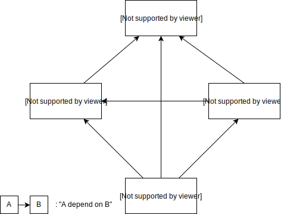

# Architecture

## Intro

This project try to enforce some form of structure at a high level to force the developer to think about dependencies when creating components. I don't claim that the architecture it propose is perfect, or even the best for the matter at hand, but I'm convinced that starting with any architectural plan, even a bad one, is best than staring with none. Architecture issue will be discovered on the way and can addressed and this process will improve the code quality. On the other hand, a project with no clear opinion about its structure will very quickly end-up with a [big ball of mud](https://en.wikipedia.org/wiki/Big_ball_of_mud) mud architecture which is arguably the worst and and for which most architecture issues tend to be too costly to fix.

The architecture proposed for this project is freely inspired by the mvc architecture, but also take influence from design ideas from hexagonal design and the [diamond architecture](https://www.youtube.com/watch?v=IY7WglVTBFo). The last two are usually associated with micro service back end. But many of the concept they use apply to front end as the view can be seen as one more interface between your service and a data source, which would be the user in this case.

## Modules

### model

This package define the bushiness data structures and the logic to manipulate them. I called it here the model to make it closer to MVC but in the diamond architecture, it would be called the domain.

This package only manipulate its own data structure, so it should not depend on any other package of this project, and this package do not depend on React. All the logic that require react are not of the domain of the model.

No code in this package should not perform IO. This rule reduce the chance of having some method that execute IO and process data with some local logic: such method are a pain to test as the test that target the internal logic need to deal with the IO and the dependencies that usually come with them.

Some project may end up with IO composition some complex that it become necessary to test them. In such situation, it would be advised to add create new file in the model project that specialized only in composing the IO, but such IO would be provided externally.

As a rule of thumbs, dev should try to push to model any code as soon as it start looking like too imperative.

### view

This package is the only one that contains react component. I think it work like the view in MVC.

This package should not be allowed to perform IO either: component that perform perform IO depend on external behavior, which in itself make them hard to test and predict, but also they usually update their own state (in the best case) once the IO is done. That mean those component have unstable states: state that may change without any prompt of the code that use the component. What we aim for in this project is to have as much as possible component that behave as pure function: for a given input, the component always render the same way and do not change on its own. Component that do depend on IO will instead use hooks that allow them to ask for a re-evaluation of some parameter of their parameters.
The actual IO should be performed by some code in the infra module.

Listening to user input, which click handler for example is definitively an IO, and in a large scale project, it may be very beneficial to push them in the infra too. But here, I didn't do that, it would have been too much code and I wasn't sure how to do it correctly.

### infra

The single purpose of this package is to perform the IO.

Having all IO regrouped strongly decoupled form the view facilitate the testing process and reduce the need for complex mock injections.
Note that infra logic should stay as simple as possible : the involvement of IO make it hard to test. If the infra need to use non-trivial logic to pre or post process the data, this logic should be moved to the domain. That was done for [serdes.ts](../00-model/src/main/serdes.ts) (Serialization/Deserialization) for example as the storage logic needed some test-worthy logic do encode and decode persisted data.

In order to be sure that infra stay decoupled from the view, the view won't import infra code directly. Instead, view will use context usage and parameter to specify thier dependency and it will be the role of the source to use the infra to fullfil those dependencies.

### source (or src)

The only role of this package is to inject the dependencies, and nothing else. In the diamond architecture, it would be the module main.
This package should get 100% coverage from a single test that create the index component and check that no error were thrown.

In many other architecture design, there is no clear package dedicated to DI as the used framework is often though to be enough. In practice, even with a good framework when the project get bigger the configuration of dependencies get non trivial. Also it often happen that some issue that dev may be tempted to solve with imperative code might be solved through pure dependency management logic. The second option tend to be the best as it will benefit from the safety and flexibility provided by the framework.
Also having this module reduce the chance of having many view component doing all a bit of DI on their side.
